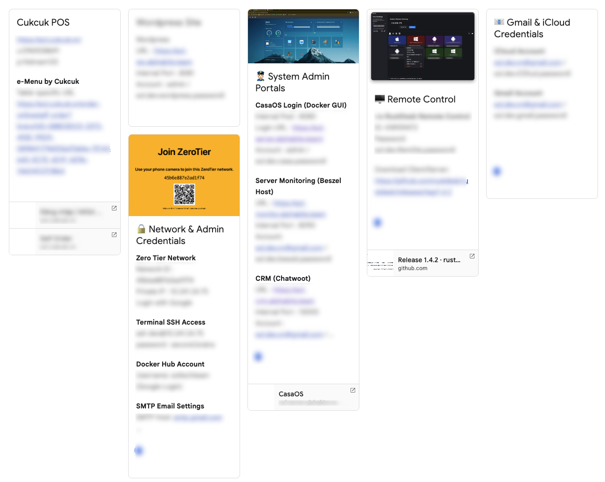
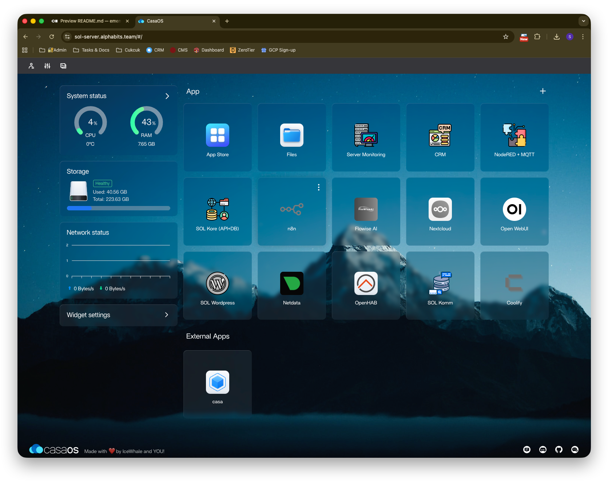

# 🌐 Tunnels and Port Mappings

Link to [CloudFlare Tunnel Mappings](https://one.dash.cloudflare.com/57250ea15f33175e8632e49a141ebf05/networks/tunnels/cfd_tunnel/971fe67e-e9da-4c1f-b2b9-14b2a5bd288c/edit?tab=publicHostname) (need admin permission)

Development Services Mapping
- sol-server.alphabits.team → http://localhost:8080
- sol-monitor.alphabits.team → http://localhost:8090
- sol-crm.alphabits.team → http://localhost:13000
- sol-kore.alphabits.team → http://localhost:11111
- sol-dashboard.alphabits.team → http://localhost:1887
- sol-wp.alphabits.team → http://localhost:8081
- sol-stats.alphabits.team → http://localhost:19999
- sol-menu.alphabits.team → http://localhost:3520
- sol-komm.alphabits.team → http://localhost:7111
- sol-ide.alphabits.team → http://localhost:8443

## Public eMenu platform (unique QR code per table)
- Production: https://em.sol.com.vn
- DEV: https://sol-emenu.alphabits.team

## Core API Backend + Admin Portal (Directus)
- Production https://kore.sol.com.vn
- DEV: https://sol-id.alphabits.team

# 🛠️ Deployments

## 🚦 PM2 Processes
- code-server (IDE + AI Coder)
- sol-emenu (Development)

## 📦 Docker Containers

Current system uses CasaOS (Docker GUI) to manage the container templates
(See `docker` folder for the docker compose config files)

### CasaOS Management GUI

Login at https://sol-server.alphabits.team/

### Directus and Postgres

docker-compose config file at `docker/sol-kore-api-database.yaml`

### Chatwoot CRM

docker-compose config file at `docker/sol-chatwoot-crm.yaml`

### Communication Server Matrix Synapse

**Matrix Server setting**

https://sol-komm.alphabits.team or just `sol-komm.alphabits.team`

**Desktop & Mobile App clients**

See full official list at [matrix.org/ecosystem/clients](https://matrix.org/ecosystem/clients/)

Recommened apps
- Element ([Official, iOS/Android/Mac/Windows/Linux](https://matrix.org/ecosystem/clients/element/))
- Element X ([iOS/Android](https://matrix.org/ecosystem/clients/element-x/))
- FluffyChat ([iOS/Android](https://matrix.org/ecosystem/clients/fluffychat/))

**Docker Compose deployment**

docker-compose config file at `docker/sol-chatwoot-crm.yaml`

# 🛠️ Private Network (Zero Tier)

Require manual approval by admin to join. [Link to ZeroTier Admin](https://my.zerotier.com/network/45b6e887e2ad1f74)

```
Network ID : 45b6e887e2ad1f74
Private IP : 10.241.24.75 (Mac Mini M4)
```

See network config and credentials at this [Google Keep note](https://keep.google.com/#NOTE/1sMDaQdPMfYYeQm4zn1H0Xbbi4eBZ9HAv2DEFn1FZFdKslTnkRjF68xNP8-cdGKo).


# 🛠️ Super Admin Account Login Credentials

Master Development Account `sol.dev.vn@gmail.com`

Master iCloud Account for Server Recovery `sol.dev.vn@gmail.com`

See full system credentials at this [Google Keep note](https://keep.google.com/#NOTE/1pTeNXWdcQyjsbZiZRsa1Q4B1M2RtcWfhSyAUmsvxbhD6yeAMETOmx-6juV_aLw).



