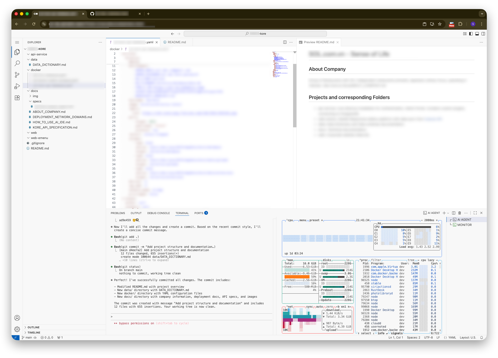

# SOL - IDE & AI Coder

Access at https://sol-ide.alphabits.team/ (via Cloudflare Tunnel)



## Online IDE based on [code-server](https://github.com/coder/code-server)

`code-server` was installed with [Homebrew](https://brew.sh/) on Mac.

Binary at `/opt/homebrew/opt/code-server/bin/code-server`.

Config file at `~/.config/code-server/config.yaml` on `dev` account.
```
bind-addr: 127.0.0.1:8443
auth: password
hashed-password: $argon2i$v=19$m=4096,t=3,p=1$a29uZHVjdG9y$HMiYs69vMELY/hcRK/Fk7dUgvD0ANXIQs0OeC1BTkl4
cert: false
```

Managed by **PM2** run at port 8443.


## Claude Code AI Agent

**Claude Code CLI** with custom settings for GLM 4.6 LLM model ([Lite Coding Plan](https://docs.z.ai/devpack/overview) from [z.ai docs](https://docs.z.ai/scenario-example/develop-tools/claude))

Run `claude` in Terminal to enter the Claude Code environment.

To turn on auto-approve mode, run 

```sh
claude --dangerously-skip-permission
```

Use *Shift-Tab* to toggle between *Planning / Manual Approve / Auto Modes*.
Highly recommend starting with Planning mode when starting a new major task.

# 💡 Code IDE Usage & AI Tips

## Basic Terminal Commands

Toggle the Terminal console with Hotkey `⌘ J`

### PM2 commands 
```sh
pm2 list
pm2 restart sol-emenu
pm2 stop sol-emenu # stop the process
pm2 stop 1 # by ID
pm2 save # Save after changes
```

### Docker commands
```sh
docker ps
docker restart sol-komm
docker stop sol-komm
```

### Realtime monitoring

- `btop` or `htop` for realtime load monitoring.

### IDE Tips

Tips for using this current online IDE.
- Use Git sidebar tab to stage changes, commit changes, and push.
- Store tech notes, specs in `docs/specs` folder.

### Basic AI Usage Tips

- Use `/init` command to scan through the project and create the initial document.
- Review README.md then acknowledge before I proceed with the task request.
- Explain the full plan in details with command lines before execution.
- Once done, commit changes and push all git branches, tags to origin.

### Project Understanding
- Use `/help` to see available commands and their descriptions
- Ask the AI to explain complex code by referencing specific files and line numbers
- Request code reviews before committing major changes
- Use the AI to generate comprehensive commit messages that follow the project's style

### Productivity Boosters
- Use tab completion for file paths and commands
- Create custom slash commands for frequently used workflows
- Ask the AI to refactor code using best practices and design patterns
- Use the AI to write unit tests for existing functions
- Generate documentation for your code automatically
- Ask AI to not wait (tail) the logs for too long, always watch log or process with a timeout.

### Code Quality & Best Practices
- Ask the AI to perform security reviews of your code
- Use the AI to identify potential performance bottlenecks
- Request code style consistency checks and fixes
- Ask for explanations of complex algorithms or design patterns
- Use the AI to suggest modern JavaScript/TypeScript equivalents for legacy code

### Troubleshooting & Debugging
- Ask the AI to explain error messages and suggest solutions
- Use the AI to debug complex issues by providing relevant code snippets
- Request help with environment setup and configuration issues
- Ask the AI to analyze logs and identify patterns or issues

### Workflow Automation
- Create custom git hooks with AI assistance
- Automate repetitive code generation tasks
- Use the AI to generate boilerplate code for new features
- Ask for help setting up CI/CD pipelines and deployment scripts
