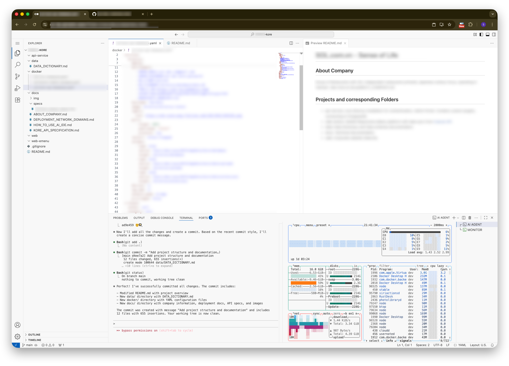

# SOL eMenu - IDE & AI Coder Guide

## 🌐 Online IDE Access

**IDE URL:** https://sol-ide.alphabits.team/ (via Cloudflare Tunnel)



### Infrastructure Details

**code-server** installed via [Homebrew](https://brew.sh/) on macOS:
- **Binary:** `/opt/homebrew/opt/code-server/bin/code-server`
- **Config:** `~/.config/code-server/config.yaml`
- **Managed by:** PM2 (port 8443)

## 🤖 AI Assistant Integration

### Supported AI Platforms
- **Claude Code** - GLM 4.6 LLM model (z.ai Lite Coding Plan)
- **Trae IDE** - Directus MCP integration
- **GLM z.ai** - Alternative AI assistant
- **Warpdev** - Additional AI support

### Claude Code Setup
```bash
# Enter Claude Code environment
claude

# Auto-approve mode (use with caution)
claude --dangerously-skip-permission

# Toggle modes: Planning → Manual → Auto
# Use Shift-Tab to switch between modes
```

**Recommendation:** Always start in **Planning mode** for major tasks.

## 🚀 Quick Start for AI Assistants

**📋 Required Reading (First Steps):**
1. `docs/AI_DEV_README.md` - Complete project overview for AI developers
2. `docs/DEPLOYMENT_NETWORK_DOMAINS.md` - Technical architecture
3. `README.md` - Project structure and components

## 🎯 IDE Usage & AI Best Practices

### 🖥️ Essential Terminal Commands

**Terminal Toggle:** `⌘ J`

**Process Management:**
```bash
# PM2 Operations
pm2 list                    # View all processes
pm2 restart web-emenu       # Restart web application
pm2 restart sol-kore-api    # Restart Directus API
pm2 logs web-emenu          # View application logs
pm2 save                    # Save PM2 configuration

# Docker Operations
docker ps                   # List running containers
docker restart the-kore     # Restart Directus container
docker stop the-kore        # Stop Directus container
```

**Monitoring:**
```bash
btop                       # Advanced system monitor
htop                       # Basic process monitor
pm2 monit                  # PM2 monitoring dashboard
```

### 🤖 AI Assistant Guidelines

**When Starting Tasks:**
1. **Always read** `docs/AI_DEV_README.md` first
2. **Review** `docs/DEPLOYMENT_NETWORK_DOMAINS.md` for technical context
3. **Explain plan** before execution with specific commands
4. **Use conventional commits** (feat:, fix:, docs:, refactor:, test:)

**Effective AI Prompts:**
- `Review the project structure and suggest improvements`
- `Explain this code: src/components/BranchTable.tsx:15-30`
- `Help me debug this error in the PM2 logs`
- `Generate comprehensive tests for the Directus API client`
- `Refactor this component following React best practices`

### 🔧 Development Workflow

**Git Integration:**
- Use Git sidebar for staging, committing, and pushing
- Store technical notes in `docs/specs/` folder
- Create feature branches for complex changes

**Code Quality:**
- TypeScript with strict typing enabled
- ESLint + Prettier for code formatting
- Tailwind CSS for styling consistency
- Follow existing naming conventions

### ⚡ Productivity Tips

**AI Collaboration:**
- Use tab completion for commands and file paths
- Request code reviews before major commits
- Ask AI to generate documentation automatically
- Use AI for security reviews and performance analysis

**Debugging Assistance:**
- Provide relevant code snippets with line numbers
- Share error messages and log outputs
- Ask for step-by-step troubleshooting guides
- Request environment configuration help

### 🔄 Deployment Best Practices

**Before Deploying:**
1. Test in development environment first
2. Check API health endpoints
3. Monitor PM2 logs for errors
4. Verify environment variables

**Deployment Commands:**
```bash
# Build and deploy web application
cd web-emenu
npm run build
pm2 restart web-emenu

# Restart API services
pm2 restart sol-kore-api
pm2 save
```

### 📊 Monitoring & Troubleshooting

**Log Locations:**
- Web app: `/Users/dev/code/emenu-kore/logs/web-emenu*.log`
- API: `/Users/dev/code/emenu-kore/logs/sol-kore-api*.log`
- PM2: `pm2 logs --lines 100`

**Health Checks:**
- Web app: http://localhost:3520/api/health
- Directus API: https://sol-kore.alphabits.team/health

**Common Issues:**
```bash
# Clear Next.js cache
rm -rf .next

# Reinstall dependencies
npm ci

# Reset PM2 processes
pm2 delete all
pm2 restart ecosystem.config.js
```

### 🔗 Project Integration Points

**API Endpoints:**
- Directus Admin: https://sol-kore.alphabits.team/admin
- MCP Integration: https://sol-kore.alphabits.team/mcp
- Web Application: http://localhost:3520

**Data Sync:**
- CukCuk API sync runs hourly via PM2
- Manual trigger: `pm2 restart cukcuk-sync`
- Sync script: `data/collectors/cukcuk/sync.js`

### 🎨 IDE Customization

**Recommended Extensions:**
- TypeScript support
- ESLint integration
- GitLens for Git history
- Live Server for development
- Docker integration

**Workspace Settings:**
```json
{
  "editor.formatOnSave": true,
  "editor.codeActionsOnSave": {
    "source.fixAll.eslint": true
  },
  "typescript.preferences.importModuleSpecifier": "relative"
}
```

## 🚨 Important Notes

- **Never commit** `.env.local` files or API tokens
- **Always test** deployment scripts before committing
- **Use HTTPS** in production environments
- **Monitor logs** regularly for unusual activity
- **Back up important configurations** before major changes
